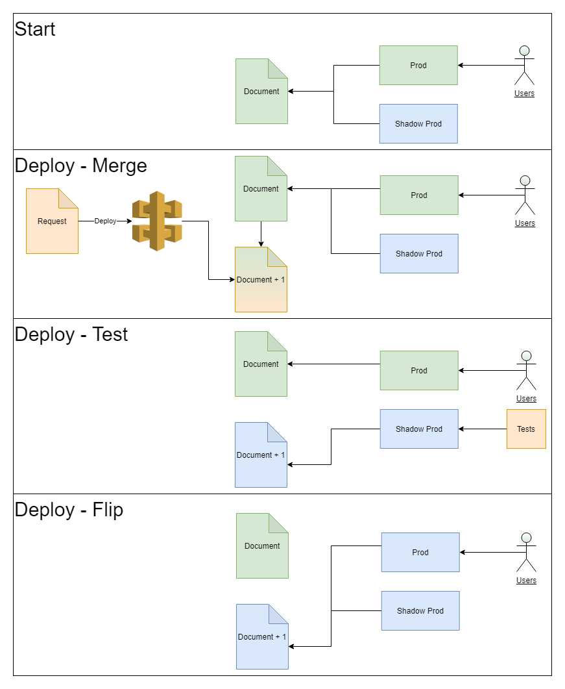
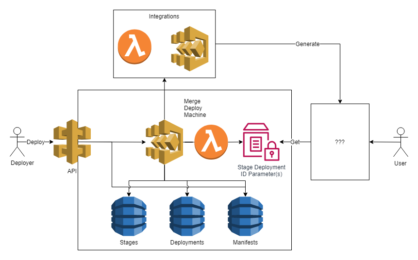

# `@thantos/merge_deploy`

   
 

Merge Deploy is a serverless deployable and extendable architecture designed to facilitate multi-tenant push and merge, followed by an atomic flip to expose updated content to users.

Plugin your own validate, merge, generate, and test logic with AWS Lambda or Step Functions.

Features:

* Push content from anywhere.
* Define your input schema.
* Define your merged schema.
* Define your merge logic.
* Define steps to take after merging (content generation)
* Define validation steps before and after merging, and before exposing you content.
* Define any number of arbitrary content stages.
* Atomic flips between stages, update content pointers in milliseconds.
* Multi-partition support (coming soon).
* Multi-stage support with unique test steps.

Workflow:

* Deploy - Push new content. Anyone with access pushes new content.
* Validate Deployment - Optional - Validate the incoming data.
* Merge - Create a new merged document by executing the merge function.
* Validate Merge Document - Optional - Validate the merged state.
* Generate - Optional - Generate content based on the merged document.
* Flip Stage X - Flip to Stage X (in stage order, where X is the current stage).
* Test Stage X- Optional - Run tests on Stage X.
* Return to Flip Stage X + 1 for all stages.
* Flip Final Stage - Flip the final, user facing stage.
* Deployment Complete.



## Usage

### Setup Infra

```ts
import { MergeDeploy, DeployStage, MergeDeployIntegration } from '@thantos/merge_deploy'; 

/**
 * Define some lambda functions.
 **/
const validateManifestFunction = new Function(...);

const mergeFunction = new Function(...);

const stateTransformFunction = new Function(...);

const smd = new MergeDeploy(this, 'mergeDeploy', {
    mergeFunction: MergeDeployIntegration.fromLambda(mergeFunction),
    validateManifestFunction: MergeDeployIntegration.fromLambda(validateManifestFunction),
    updatedManifestHook: MergeDeployIntegration.fromLambda(stateTransformFunction),
    stages: [ // Optionally define one or more stages
        new DeployStage(this, 'firstStage', {
            name: 'first'
        })
    ]
});
```

### Merge Function (Lambda)

```ts
import { MergeHandler } from "@thantos/merge_deploy";

export interface TestRequest {
  tenantId: string;
  values: string[];
  command?: 'CLEAR' | 'MERGE'; // default merge
}

export interface TestManifest {
  [tenantId: string]: string[];
}

/**
 * Example of a merge function.
 * 
 * Updates a "tenant" in the TestManifest. Increments the top level count and the tenant level count.
 **/
export const handler: MergeHandler<TestRequest, TestManifest> = (event) => {
  const tenantRecord = event.manifest.tenants[event.request.tenantId] || {
    count: 0,
    uniqueValues: [],
    recentValues: []
  };

  const clear = event.request.command === 'CLEAR';

  return Promise.resolve({
    manifest: {
      version: '1',
      count: clear ? 1 : event.manifest.count + 1,
      tenants: {
        ...(clear ? {} : event.manifest.tenants),
        [event.request.tenantId]: {
          count: tenantRecord.count + 1,
          recentValues: event.request.values,
          uniqueValues: [
            ...new Set([...event.request.values, ...tenantRecord.uniqueValues])
          ]
        }
      }
    }
  });
};
```

### Validate Manifest (Lambda)

> Optional, this function can be excluded altogether.

```ts
import { ValidateManifestHandler } from '@thantos/merge_deploy';

export interface TestManifest {
  [tenantId: string]: string[];
}

export const handler: ValidateManifestHandler<TestManifest> = () => {
  return Promise.resolve({
    valid: true
  });
};
```

### Transform (Lambda)

> Optional, this function can be excluded altogether.


```ts
import { StateTransformerHandler } from '@thantos/merge_deploy';

export interface TestManifest {
  [tenantId: string]: string[];
}

export const handler: StateTransformerHandler<TestManifest> = () => {
  // do something like generate a s3 file
};
```

See examples:

* [Deployer App](https://github.com/thantos/thantos_constructs/tree/dev/packages/deployer_app)

## Options

### MDIntegration

* Lambda - `MergeDeployIntegration.fromLambda(... some function ...);`
* Step Functions - Coming Soon

### mergeFunction: MDIntegration

A function that is run after the validate request step.

* Lambda - Uses the `MergeHandler` handler.

### validateManifestFunction?: MDIntegration

Optional. A function that is run after the merge step. Here a consumer could validate that the manifest is valid.

* Lambda - Uses the `ValidateManifestHandler` handler.

### updatedManifestHook?: MDIntegration

Optional. A function that is run after the validate manifest step. Here a consumer could generate resources like s3 file from the merged manifest.

* Lambda - Uses the `StateTransformerHandler` handler.

### stages?: DeployStage[]

Each stage represent a testable step in the deployment process. Each step has optional prepare and test integrations.

#### DeployStage::name: string

The name of the stage. Must be unique.

#### DeployState::testFunction?: MDIntegration

> TODO

#### DeployState::prepareFunction?: MDIntegration

> TODO

## Architecture



* `Api` - API Gateway which provides operations to deploy, get deployment status, get manifests, and get stage states.
* `Merge Deploy Machine` - API Gateway which integrates facilities the merge deploy workflow. Calls other lambdas and step function provided by the consumer.
* `Stages` - Dynamo Table which contains the stage to deployment/manifest ID mapping.
* `Deployments` - Dynamo Table which contains each deployment, its status, input, etc.
* `Manifests` - Dynamo Table which contains all of the generated manifests, one for each deployment, if the workflow made it to that point.
* `Stage Deployment ID Parameter(s)` - A SSM Parameter for each stage that references the current manifest ID.
* `Integrations` - Lambdas and/or Step Functions provided by the consumer to customize the workflow.

## Extensions

* [Tester](https://github.com/thantos/thantos_constructs/tree/dev/packages/merge_deploy_tester)
* GUI - Coming Soon
