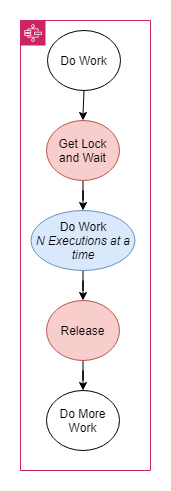
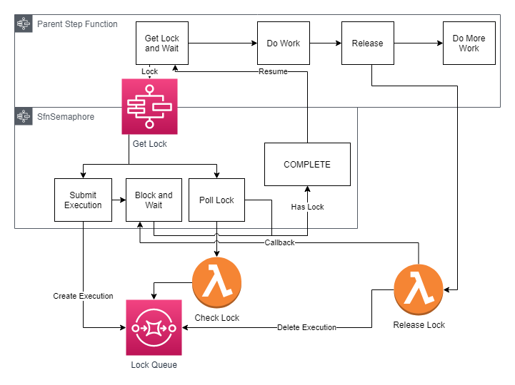

# `@thantos/sfn-semaphore`

  

An implementation of a semaphore for use with AWS Standard Step Functions. 

Implemented as a nested step function to be invoked by the parent. Uses a single FIFO queue and a blocking step function execution. A lambda function is invoked at the end to release the semaphore.



Features:

* Semaphore like blocking on a step function task
* Multi-partition support (coming soon)
* n-currency (coming soon, 1-concurrency supported now)
* "Fast-start" - Starting one execution faster than the polling interval.

## Usage

```typescript
import { SfnSemaphore } from '@thantos/sfn-semaphore';

export MySfnStack extends Construct {
    constructor(...) {
        const lock = new SfnSemaphore(this, 'myLock');

        const definition = lock.requestLockAndWaitTask({ // Block and wait the step function until the lock is available 
          id: JsonPath.stringAt('$$.Execution.Name'), // Unique ID
          groupId: DEFAULT_GROUP // Partition Id for the semaphore
        })
        .next(/*... do something ...*/)
        .next(lock.relinquishLockTask({ // Release the lock
          id: JsonPath.stringAt('$$.Execution.Name'),
          groupId: DEFAULT_GROUP
        }));

        new StateMachine(this, 'myMachine', { definition });
    }
}
```

## Architecture



* 'Get Lock' Step Function - Standard Step Function with ~4 stages, including a block and wait.
* 'Lock Queue' FIFO SQS Queue - Queue which maintains the executions waiting for a lock.
* Check Lock Function - Lambda function which checks to see if the lock is available.
* Release Lock Function - Lambda function which releases the lock and tries to start the next execution.
